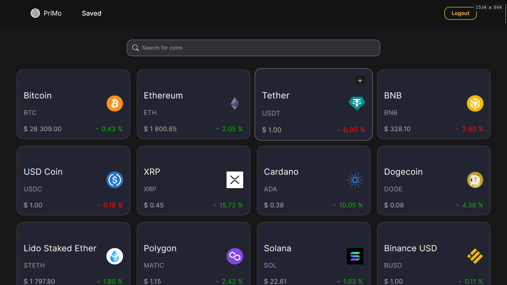

<h1 align='center'>PriMo | Crypto Prices Tracker</h1>



## Features

- **Track crypto market from any device**
- **More than 100 popular coins**
- **Save favorite coins to bookmarks**
- **Registration with Google account**


## Tech stack

`Next.js`
Full stack framework

`React`
UI library

`Stitches`
CSS in JS library similar to Emotion with great UX and additional features like compound variants

`Prisma | PostgreSQL`
Industry standard database and ORM to easily form queries

`Next-auth`
Authentication with Auth2 providers, specifically Google

`Tanstack Query | TRPC`
Type-safe data fetching and mutation

`Zustand`
Global state management

`Commitizen | Commitlint | Husky`
Lint git commit messages according to conventional commits

`ESLint | Prettier`
Code linting and formatting

## Deployment

Clone and install
```bash
git clone https://github.com/m1tyya/crypto-tracker.git
cd crypto-tracker
yarn
```

Run a development server
```bash
yarn dev
```
